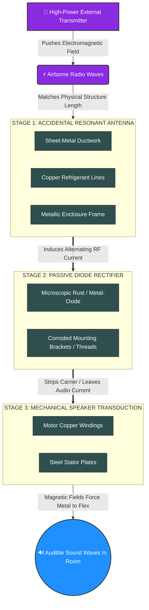
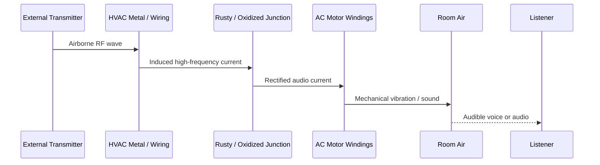
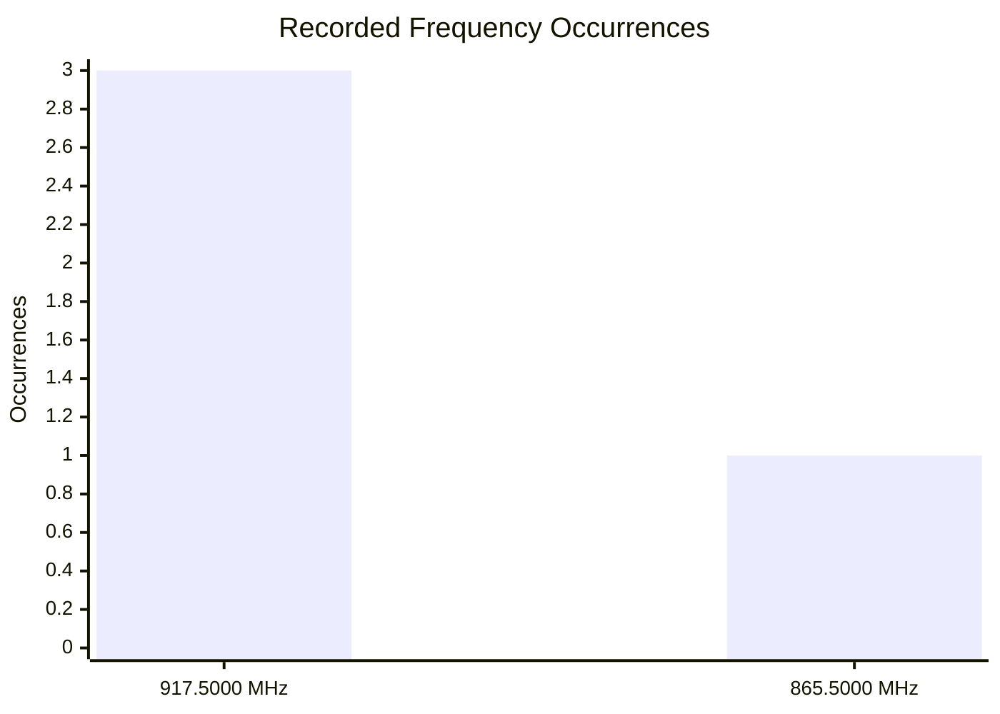
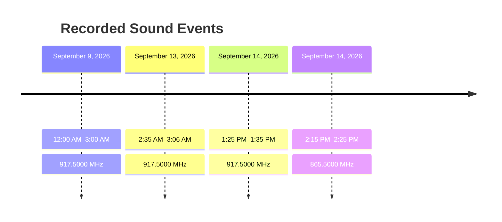
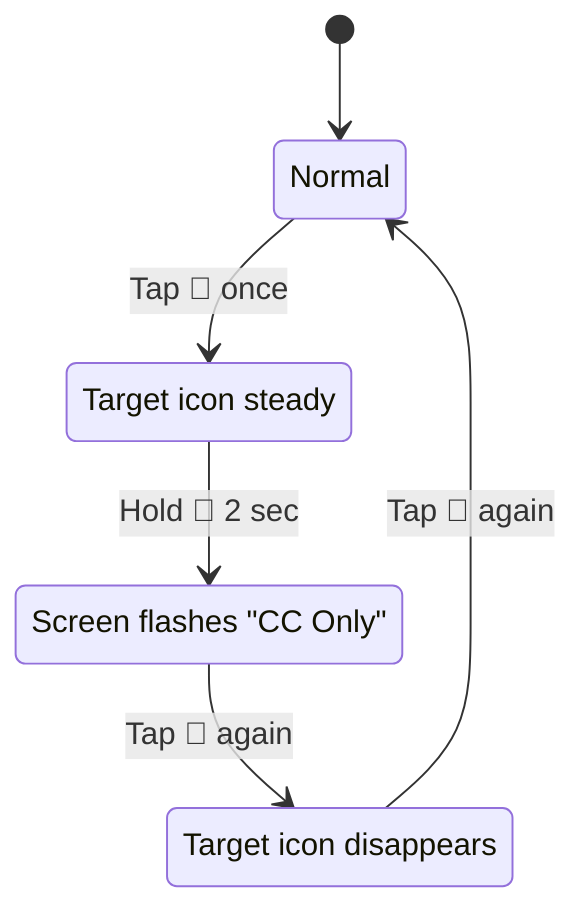
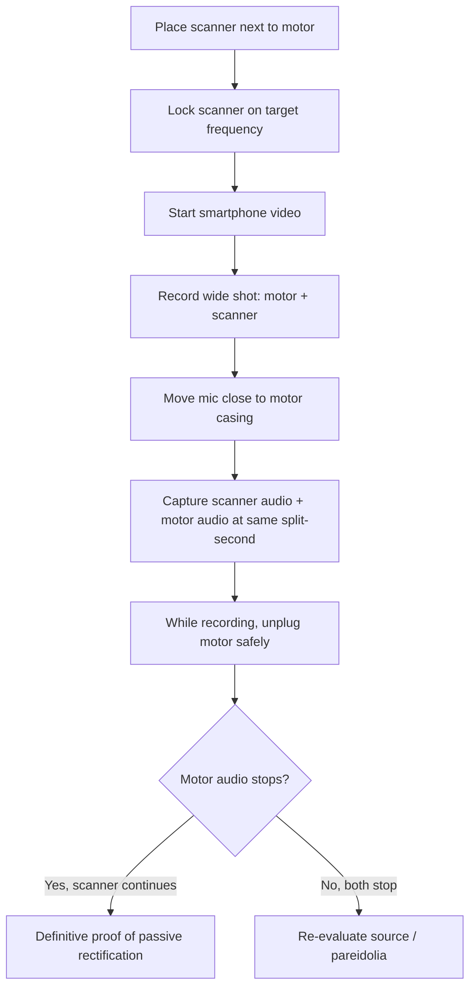

# 📡 ELECTROMAGNETIC AUDIO TRANSDUCTION  
### Passive RF Rectification, “Rusty Bolt” Audio, and Uniden BC355N Field Operations

[]()
[]()
[]()
[]()
[]()

> [!WARNING]
> - **This research and report is done by a real person hearing this for real. Hearing a whole convosation next to a HVAC unit with no one their makes you feel crazy until you take a read everything in the repo below is actually real researched, documented and needs reported because people have been illgeally breaking the law for the longest time email is down in the repo below contact me and i`ll give you the source and who they are.** 

> **Repository concept:** `DuckyOnQuack-999/ELECTROMAGNETIC-AUDIO-TRANSDUCTION`  
> **Purpose:** Document the theory, field logs, scanner procedures, evidence capture, and regulatory reporting path for a reported case of an unmodified AC motor/HVAC chassis producing intelligible audio via passive RF rectification.

---

> [!WARNING]
> **Safety, Legal, and Scope Notice**
> - Do not open, modify, or touch energized AC equipment. Use a licensed electrician for any mains wiring, grounding, or motor work.
> - This repository is for informational, diagnostic, and documentation purposes only. It is not legal, medical, or engineering advice.
> - Many apparent “voices from appliances” are **auditory pareidolia**, local audio leakage, or mechanical noise. This repo provides methods to distinguish real RF demodulation from pareidolia.
> - Frequency numbers in early notes may have been captured during broad scans and are not automatically confirmed sources. Treat all frequencies as **observations until verified**.

---

## 📚 Table of Contents

1. [Executive Summary](#-executive-summary)
2. [Scientific Foundations](#-scientific-foundations)
3. [Passive Intermodulation / “Rusty Bolt” Effect](#-passive-intermodulation--rusty-bolt-effect)
4. [Full System Transduction Diaphragm](#-full-system-transduction-diaphragm)
5. [Observation Logs & Telemetry](#-observation-logs--telemetry)
6. [Hardware Manual: Uniden BC355N](#-hardware-manual-uniden-bc355n)
7. [Field Operations Guides](#-field-operations-guides)
8. [Evidence Capture Protocol](#-evidence-capture-protocol)
9. [Regulatory & Law Enforcement Reporting](#-regulatory--law-enforcement-reporting)
10. [Physical Mitigation](#-physical-mitigation)
11. [AI Research Prompt](#-ai-research-prompt)
12. [Appendices](#-appendices)

---

## 🧭 Executive Summary

This repository merges the entire research thread into one field-ready document.

Key conclusions:

- **Electricity is everywhere** — in the atmosphere, inside matter, and inside the human body.
- **Audio can be transferred by electricity** — microphones convert sound to electrical signals; speakers convert them back.
- **Audio can be transferred wirelessly through air** — via radio waves, infrared light, or laser beams.
- **AC motors can cause crosstalk** — through magnetic induction, dirty power, and ground loops.
- **A motor can be turned into a speaker** — by feeding amplified audio into its coils and using its casing as a diaphragm.
- **An unmodified motor miles away cannot transmit audio** — but an unmodified motor **right next to you** may accidentally demodulate strong RF via the “Rusty Bolt” effect, or the sound may be pareidolia.
- **Anyone can experience this** — neurotypical and autistic people alike.
- **The Uniden BC355N** is the field scanner used here. It is DC-powered, covers 25–956 MHz, and has Close Call RF Capture.
- **462.8875 MHz was not the target** — it was a baseline scan capture. The logged target observations are **917.5000 MHz** and **865.5000 MHz**.
- **917.5000 MHz** is in the 902–928 MHz ISM band. It is usually digital data, but analog voice can appear from older cordless phones, baby monitors, wireless mics, or illegally amplified Part 15 gear.
- **Reporting paths:** FCC Chicago Field Office, Illinois Commerce Commission, FBI tips, APCO, and Illinois State Police TSB.
- **Mitigation:** snap-on ferrite chokes, proper grounding, shielded cables, 90° crossing, and power isolation.

---

## 🔬 Scientific Foundations

### 1. Is There Electricity Around Us at All Times?

**Yes.** Weak electric fields, charged ions, static forces, and natural electricity surround us and exist inside us.

#### In the Air and Atmosphere

- Earth has a **global electric circuit**.
- On clear days, air above ground is positively charged; ground is negatively charged.
- Fair-weather electric field near the ground: **about 100 volts per meter**.
- Cosmic rays and solar radiation create **ions** in the air.
- Wikipedia notes: “the atmospheric electric field is negatively directed (meaning toward the ground) in fair weather.”

#### Inside All Matter

- Atoms contain **positively charged protons** and **negatively charged electrons**.
- Opposite charges attract and hold atoms/molecules together.
- Without electrostatic forces, matter could not exist in its normal shape.

#### Inside the Human Body

- Cells use tiny electrical signals.
- Nerves send electrical impulses.
- The heart’s rhythm is controlled by electrical currents.
- SparkFun Learn: electricity is at work “from the lightning in a thunderstorm to the synapses inside our body.”

---

### 2. Using Electricity to Transfer Audio

Yes. Electricity is the primary way we capture, transfer, and play back audio.

#### The 3-Step Process


1. **Conversion to Electricity (Input):**  
   A microphone diaphragm moves a magnet/coil, creating a fluctuating electrical current matching the sound.

2. **Transmission (Wire):**  
   The varying current travels through conductive copper wires. Voltage rises/falls in a pattern mirroring the sound wave.

3. **Conversion Back to Sound (Output):**  
   A speaker coil near a magnet moves a cone, vibrating air and recreating sound.

#### Analog vs Digital Audio

| Format | How It Works | Examples |
|---|---|---|
| **Analog Audio** | Voltage continuously fluctuates in direct proportion to the sound wave. | 3.5mm headphone jacks, XLR studio mics, instrument cables |
| **Digital Audio** | Analog wave is sampled millions of times per second and converted to binary 1s/0s. | USB audio, HDMI, coaxial digital cables |

---

### 3. Wireless Audio Through the Air

Electricity cannot travel through air on its own without dangerous high-voltage sparking. Instead, devices use electricity to generate **electromagnetic waves**.

#### Three Main Methods

| Method | How It Works | Examples |
|---|---|---|
| **Radio Frequency (RF)** | Electrical audio signal feeds a transmitter; antenna converts current to radio waves; receiver converts back. | AM/FM, Bluetooth, Wi-Fi |
| **Infrared Light (IR)** | Audio signal drives an IR LED that flickers; photodiode receives and converts back to current. | Wireless headphones, remote audio |
| **Laser / Li-Fi** | Audio voltage modulates laser brightness; solar panel/light sensor converts back to current. | DIY laser audio experiments |

#### Universal 3-Step Formula


---

### 4. Crosstalk From an AC Motor

You hear crosstalk from an AC motor because the motor acts as an **aggressor** and your audio equipment acts as a **victim**.

An AC motor pulls large fluctuating currents. This creates electromagnetic chaos that can enter audio components as hum, buzz, or whine.

#### Three Primary Entry Points

| Entry Point | Mechanism | Result |
|---|---|---|
| **Magnetic / Inductive Coupling** | Motor’s spinning magnetic fields cut across unshielded audio cables. | Induced current treated as audio. |
| **Power-Line Modulation (“Dirty Power”)** | Motor spikes distort the 60 Hz sine wave; harmonics enter power lines. | Noise bypasses power supply into amplification stage. |
| **Shared Ground Loops** | Motor dumps stray current into common ground. | Voltage difference causes loud continuous hum. |

#### Diagnosis and Fixes

- Physically separate audio gear from motor and power lines.
- Cross wires at **90 degrees**, never parallel.
- Use **shielded cables** or balanced XLR.
- Plug audio into an **isolated power conditioner** or different circuit.
- Check ground connections.

---

### 5. How an AC Motor Intensifies Audio Over Electricity

An AC motor does not “amplify” music helpfully. It **modulates**, **distorts**, and **overrides** the audio signal.

| Mechanism | What Happens | What You Hear |
|---|---|---|
| **Amplitude Modulation** | Motor’s magnetic fields fluctuate resistance/inductance in nearby audio components. | Tremolo/fluttering effect. |
| **Microphonic Induction** | Physical vibration shakes audio components, which act like microphones. | Booming feedback/rumble. |
| **Harmonic Distortion / Superposition** | Motor’s 50/60 Hz and harmonics add to audio wave. | Loud buzz/whine drowning out original sound. |

---

### 6. Turning a Motor Into a Speaker

Yes — a motor and a speaker share the same core concept: **coils of wire around magnets**.

| Device | How It Works |
|---|---|
| **Speaker** | Audio current through coil creates shifting magnetic field; moves cone; vibrates air. |
| **Motor** | Current through coil creates shifting magnetic field; pushes rotor in circles. |

#### Basic DIY Motor Speaker

1. **Wiring:** Run audio output into an audio amplifier (e.g., LM386). Connect amplifier output to motor power leads.
2. **Sound Production:** Audio current rapidly shifts direction; motor shaft vibrates instead of spinning fully.
3. **Acoustic Volume:** Hot-glue motor casing to a plastic cup or paper plate to act as a speaker cone.
4. **Examples:** Hoverboards/Segways beep through motors; 3D printers play tunes through stepper motors.

> [!NOTE]
> This only works when the motor is **driven by an audio signal**. An unmodified motor far away cannot transmit audio.

---

### 7. Unmodified Motor Miles Away vs. Right Next to You

| Scenario | Possible? | Explanation |
|---|---|---|
| **Unmodified motor miles away transmits audio** | **No** | No microphone, no data input, heavy inertia, severe distance limitations. |
| **Unmodified motor right next to you plays audio** | **Possible, rare** | Passive Intermodulation / “Rusty Bolt” effect, or auditory pareidolia. |

#### If You Are by the Motor

You may be witnessing:

- **Passive Intermodulation (PIM)** — metal-oxide junction acts as a crude diode.
- **Accidental crystal radio behavior** — wiring acts as antenna; corrosion acts as demodulator; motor plates act as speaker.
- **Auditory pareidolia** — brain finds patterns in motor noise.

---

### 8. Can a Normal, Non-Autistic Person Hear This?

**Yes.** Both phenomena are universal.

- **Physical radio phenomenon:** Real acoustic sound waves; anyone with standard hearing can hear it. A phone recording will capture it.
- **Auditory pareidolia:** A fundamental human brain trait. Anyone can experience it, especially when tired, stressed, or in a quiet room with continuous noise.

> **Test:** Record the motor with your phone. If the audio disappears on the recording and you only hear motor hum, it is likely pareidolia. If the recording captures the voices, it is a physical acoustic event.

---

## 📡 Passive Intermodulation / “Rusty Bolt” Effect

### Abstract

This section documents the hypothesis that an unmodified AC motor/HVAC chassis can accidentally act as an analog radio receiver.

The system mimics:

1. **Antenna**
2. **Demodulator**
3. **Acoustic transducer**

### Three-Stage Demodulation Loop



### Stage 1: RF Induction — The Accidental Antenna

- HVAC ductwork, copper refrigerant lines, structural framing, and electrical conduits act as an unintentional resonant antenna.
- High-power radio waves strike metal surfaces.
- Electromagnetic fields force free electrons to vibrate.
- This induces a high-frequency alternating current in the appliance frame.

### Stage 2: Passive Rectification — The Accidental Diode

- RF carrier waves oscillate millions of times per second.
- This is too fast to vibrate heavy steel plates audibly.
- Where metal touches imperfectly — rust, loose threads, oxidized brackets — a **metal-oxide junction** forms.
- This junction acts like a crude semiconductor diode.
- It allows current in one direction, stripping the RF carrier and leaving low-frequency audio current.

### Stage 3: Acoustic Transduction — The Accidental Speaker

- Audio current enters the motor’s dense copper stator coils.
- The current creates a shifting magnetic field pulsing at voice frequencies (300–3,000 Hz).
- The motor shaft cannot spin fast enough, so stator plates and casing flex and vibrate.
- The machine casing acts as a speaker cone, pushing audible sound into the room.

### Full System Transduction Diaphragm

```text
[ AM / FM / TWO-WAY RF SOURCE ]
              │
              │  (Airborne Radio Waves Wave-Matching to ~25.5" Conduit Structures)
              ▼
 ┌──────────────────────────────────────────────────────────┐
 │ STAGE 1: ACCIDENTAL RESONANT ANTENNA                     │
 │ • Galvanized Sheet Metal Ductwork                        │
 │ • Bare Copper Fluid Refrigerant Lines                    │
 │ • Structural Metallic Equipment Enclosure                │
 └────────────────────────────┬─────────────────────────────┘
                              │
                              │ (Induced High-Frequency Alternating Current)
                              ▼
 ┌──────────────────────────────────────────────────────────┐
 │ STAGE 2: PASSIVE SEMICONDUCTOR RECTIFIER                 │
 │ • Corroded Mounting Screws & Oxidized Brackets           │
 │ • Loose Conduit Coupling Threads                         │
 │ [Metal] ──> [Microscopic Rust / Metal-Oxide] ──> [Metal] │
 └────────────────────────────┬─────────────────────────────┘
                              │
                              │ (RF Carrier Stripped / Low-Frequency Audio Current Left)
                              ▼
 ┌──────────────────────────────────────────────────────────┐
 │ STAGE 3: ACOUSTIC TRANSDUCTION MECHANICAL SPEAKER        │
 │ • Fluctuating Audio Current Enters Dense Motor Windings   │
 │ • Rapidly Shifting Magnetic Field Created in Core         │
 │ • Heavy Steel Stator Plates Physically Flex and Rattle    │
 └────────────────────────────┬─────────────────────────────┘
                              │
                              │ (Mechanical Micro-Vibrations Shaking Casing Housing)
                              ▼
                 [ AUDIBLE SOUND WAVES IN AIR ]
```

### Mermaid Sequence View



### Prime External Signal Sources

| Source | Power / Notes | Why It Can Bleed |
|---|---|---|
| **High-Power AM Broadcast Towers** | 10,000–50,000 W | Amplitude modulation; large waves; highly susceptible to passive rectification. |
| **Amateur (Ham) Radio Operators** | Up to 1,500 W | High-wattage transmissions; antenna proximity; structural resonance. |
| **CB Operators with Linear Amplifiers** | Illegal boost from 4 W to hundreds/thousands | Overpowered local signal floods household wiring. |
| **Unlicensed Long-Range Part 15 Gear** | Illegal external amplifiers | Baby monitors, wireless mics, older cordless phones modified for long range. |
| **GMRS / Land Mobile Repeaters** | Up to 50 W | High local RF density; can induce currents in unshielded metal. |

### Frequency Notes

- **462.8875 MHz** — GMRS Channel 20 repeater output. In the thread, this was a **baseline scan capture**, not the confirmed target.
- **917.5000 MHz** — 902–928 MHz ISM band. Usually digital data: smart meters, LoRaWAN, RFID, industrial sensors. If voice is heard, possible older analog cordless phone, wireless mic, baby monitor, or illegally amplified Part 15 device.
- **865.5000 MHz** — Logged as a spectral shift capture. Not fully decoded in the thread. Could be image/intermod, land mobile, or other local transmitter. Log and report.
- **AM Broadcast Band (530–1700 kHz)** — The BC355N does **not** cover this. Use a standard portable AM radio to check for commercial AM broadcast bleed.

---

## 📊 Observation Logs & Telemetry

### Sound Frequency / Time Observation Log

**Contact registers:** `colonyhackerz1@gmail.com`, `joshinhd1@gmail.com`

| # | Date | Time Window | Target Frequency | Detection Type | Active Duration |
|---:|---|---|---|---|---|
| 01 | September 9, 2026 | 12:00 AM – 03:00 AM | 917.5000 MHz | Acoustic Demodulation Event | ~180 min (3.0 h) |
| 02 | September 13, 2026 | 02:35 AM – 03:06 AM | 917.5000 MHz | Acoustic Demodulation Event | ~31 min |
| 03 | September 14, 2026 | 01:25 PM – 01:35 PM | 917.5000 MHz | Acoustic Demodulation Event | ~10 min |
| 04 | September 14, 2026 | 02:15 PM – 02:25 PM | 865.5000 MHz | Spectral Shift Capture | ~10 min |

### Frequency Summary

| Frequency | Sept. 9 | Sept. 13 | Sept. 14 | Total Recorded Occurrences |
|---|---:|---:|---:|---:|
| **917.5000 MHz** | ✓ | ✓ | ✓ | 3 |
| **865.5000 MHz** |  |  | ✓ | 1 |

### Frequency Chart



### Chronological Timeline



> [!NOTE]
> These frequencies are **reported measurements/observations**. No source or cause is inferred solely from these numbers. Additional observations can be appended chronologically.

---

## 🎛️ Hardware Manual: Uniden BC355N

The Uniden BC355N is a compact, multi-band **analog** mobile/base radio scanner.

### Key Specifications

| Feature | Detail |
|---|---|
| **Frequency Coverage** | 25 MHz – 956 MHz |
| **Channels** | 300 programmable |
| **Modes** | AM, FM, analog only |
| **Close Call** | Yes — RF Capture Technology |
| **Power** | 13.8 V DC |
| **Home Power** | AC-to-DC wall adapter |
| **Vehicle Power** | DC cigarette lighter cord |
| **Bands** | CB, Ham, Aircraft, Marine, Police/Fire/Emergency, Weather, 800 MHz |
| **Limitation** | Does not receive standard AM broadcast band 530–1700 kHz |

### Control Layout

```text
+-------------------------------------------------------------+
|                                                             |
|  [ SQUELCH (SQ) ]                              [ DISPLAY ]  |
|  [ VOLUME (VOL) ]                             (Orange Back) |
|                                                             |
|  [HOLD]       [UP (▲)]      [DOWN (▼)]      [ 800 MHz ]     |
|  [PRIVATE]    [PD/FD/EMG]   [AIR/MRN]                       |
|  [🎯 CC]      [WX]          [CB]                            |
|                                                             |
|         [SEARCH]      [L/O]         [BAND]        [PROG]    |
+-------------------------------------------------------------+
```

### Full Button & Control Run-Down

| Control | Location | Function |
|---|---|---|
| **VOLUME / POWER** | Bottom-left knob | Turns unit on/off; adjusts audio output. |
| **SQUELCH (SQ)** | Top-left knob | Mutes background static. Turn CCW until hiss, then CW until static snaps shut. |
| **HOLD** | Top-left keypad, red dot | Freezes scanner on current frequency. Press again to release. |
| **UP (▲) / DOWN (▼)** | Top row | Manually step frequencies or change scan direction. |
| **800 MHz** | Top-right | Jumps to preprogrammed 800 MHz bank. |
| **PRIVATE** | Left, second row | Accesses user-programmed memory slots. |
| **PD/FD/EMG** | Middle row | Scans preprogrammed police/fire/emergency analog frequencies. |
| **AIR/MRN** | Middle row | Toggles civil aviation AM and VHF marine bands. |
| **🎯 CLOSE CALL (CC)** | Bottom-left | Activates Close Call RF Capture. |
| **WX** | Bottom row | Scans 7 NOAA weather channels. |
| **CB** | Bottom row | Scans 40 standard CB channels (26.965–27.405 MHz). |
| **SEARCH** | Bottom row | Starts manual frequency search between band limits. |
| **L/O** | Bottom row | Lockout — skips current frequency in future scans. |
| **BAND** | Bottom row | Cycles through factory frequency blocks. |
| **PROG** | Bottom-right | Enters program mode to store active frequency. |

### Close Call Modes



| Mode | How to Enter | Behavior |
|---|---|---|
| **Background CC Priority** | Tap 🎯 once | Scans normal channels but checks for local RF every 2 seconds. |
| **Dedicated CC Only** | Hold 🎯 2 seconds | 100% processing power on local RF capture. Best next to motor. |
| **Close Call Off** | Tap 🎯 again | Deactivates local RF capture. |

### Lockout (L/O)

- When scanner stops on unwanted frequency, tap **L/O** once.
- Scanner skips it permanently.
- To clear a lockout, hold **L/O** for 2 seconds while on that band.

### Display Codes

| Code | Meaning |
|---|---|
| **CC Only** | Dedicated Close Call mode active. |

### Power: DC Powered

- The BC355N is powered by **13.8 V DC**.
- Home: AC-to-DC wall adapter.
- Vehicle: DC cigarette lighter cord.
- Back panel: standard black DC barrel plug.

---

## 🕹️ Field Operations Guides

### GUIDE 1: Complete Hardware Master Reset

Use this to clear old lockouts, saved channels, and registers.

```bash
# 1. Turn VOLUME knob fully counterclockwise to OFF
# 2. Press and hold: [HOLD] + [L/O] + [PROG]
# 3. While holding, turn VOLUME knob clockwise to ON
# 4. Hold 3 seconds until screen flashes:
CLEAr
# 5. Release keys
```

### GUIDE 2: Clean Close Call Only Scan

```bash
# 1. Master reset first if memory is cluttered
# 2. Turn SQUELCH (SQ) clockwise until background static snaps shut
# 3. Press and hold 🎯 CLOSE CALL for 2 seconds
# 4. Verify screen shows:
CC Only
# 5. Place antenna against HVAC/motor housing
# 6. When signal hits, press HOLD to freeze frequency
```

### GUIDE 3: Save Discovered Frequency to Private Bank

Because the BC355N has no numeric keypad:

```bash
# 1. Ensure target frequency is frozen on screen with HOLD
# 2. Press PROG once
# 3. An empty channel slot blinks (e.g., Ch 01)
# 4. Press and hold PRIVATE for 2 seconds
# 5. Listen for BEEP
# 6. Tap PRIVATE to monitor saved channel
```

### GUIDE 4: Lock Out Unwanted Frequencies

```bash
# When scanner stops on unwanted signal:
Press L/O once
# Scanner resumes; frequency is skipped in future scans
```

### GUIDE 5: Scanning CB, Ham, and AM Broadcast

| Target | Scanner Action | Notes |
|---|---|---|
| **CB** | Press CB | 40 channels; 26.965–27.405 MHz. |
| **Ham** | Press SEARCH then BAND | Check 28.000–29.700 MHz, 50–54 MHz. |
| **AM Broadcast** | Use separate portable AM radio | BC355N does not cover 530–1700 kHz. |

### GUIDE 6: Using a Radio Receiver to Pick Up the Signal

1. Use a portable shortwave/AM receiver or SDR.
2. Scan standard AM broadcast band.
3. Scan CB band.
4. Scan Ham bands.
5. When audio matches motor audio at same split-second, log frequency and signal strength.
6. Use **Tecsun PL-330/PL-880** or **RTL-SDR Blog V4** for advanced tracking.

### GUIDE 7: Best Equipment to Capture Evidence

| Purpose | Recommended Gear | Why |
|---|---|---|
| **Acoustic capture** | Zoom F-Series, Tascam recorder | Shielded, balanced XLR inputs. |
| **Directional mic** | Sennheiser MKH-416, E-Image PM-510 | Isolates motor sound from room. |
| **RF measurement** | GQ EMF-390, LATNEX HF-B3G | Measures RF spikes; data logging. |
| **Scanner** | Uniden BC355N | Close Call, analog voice, 25–956 MHz. |
| **Phone** | Any modern smartphone | Video + audio dual-source proof. |

### GUIDE 8: Handling 917.5000 MHz

- BC355N **can** pick up 917.5000 MHz (coverage 806–956 MHz).
- Usually digital data: smart meters, LoRaWAN, RFID.
- If you hear talking:
  - Older 900 MHz cordless phone.
  - 900 MHz wireless microphone.
  - Analog baby monitor.
  - Illegally amplified Part 15 device.
  - If heard any voices especially on **865.5000MHz** that sounds like harassment or role-play report to the following
- [Regulatory & Law Enforcement Reporting](#-regulatory--law-enforcement-reporting).

---

## 📋 Evidence Capture Protocol

### Dual-Source Acoustic Verification Test



### Logging Template

```markdown
| # | Date | Time Window | Frequency | What Was Heard | Duration | Notes |
|---:|---|---|---|---|---|---|
| 1 | YYYY-MM-DD | HH:MM–HH:MM | XXX.XXXX MHz | Voice/music/tone | XX min | Weather, motor speed, etc. |
```

### FCC Complaint Template

```text
TECHNICAL ASSISTANCE REQUEST: PASSIVE INTERMODULATION / UNAUTHORIZED TRANSMISSION
Target Frequency: [Insert confirmed scanner frequency]
Reporting Region: Illinois / FCC Chicago Field Office Jurisdiction
Affected Hardware: Unmodified Residential HVAC System / AC Induction Motor
Diagnostic Tool: Uniden BC355N Analog Base/Mobile Receiver

Description:
A high-power external radio frequency transmission is actively causing heavy electromagnetic interference within my residence. The stray RF field is inducing an alternating current across unshielded structural metal and copper plumbing lines associated with my household HVAC system. Due to an accidental metal-oxide junction (diode effect) within the appliance chassis, this signal is being passively rectified, forcing raw audio-frequency current into the stator windings of an unmodified AC motor. The physical casing of the motor is subsequently transducing this current into audible acoustic waves.

Using a dedicated analog receiver positioned directly at the motor chassis, the invading signal has been isolated and logged. The signal density is sufficient to mechanically drive heavy motor plates, indicating the likely presence of an overpowered, poorly filtered, or unauthorized high-gain local transmitter operating in immediate geographic proximity to this residence. Chronological time logs and synchronized dual-source audio recordings demonstrating passive rectification are prepared for analysis by FCC field enforcement agents.
```

### FBI Tip Template

```text
SUBJECT: REPORT OF UNAUTHORIZED LONG-RANGE TRANSMISSIONS / INTERCEPTED VOICE COMMUNICATIONS

LOCATION OF OBSERVATION: [City, State, neighborhood]
FREQUENCY DETECTED: [Frequency] MHz (Analog Audio Modulation)
RECEIVER USED: Uniden BC355N Analog Scanner

DESCRIPTION:
I am submitting a formal report regarding persistent, unauthorized long-range voice communications. While this frequency spectrum is federally restricted to short-range, low-power consumer data or localized Part 15 devices, active human voice communications are being intercepted across an extensive geographic range.

The signal density is severe enough to cause passive intermodulation inside my residence, inducing an electrical audio current across household infrastructure and causing an unmodified AC motor to physically vibrate the audible speech into the room.

NARRATIVE / INTERCEPTED CONTENT SUMMARY:
[Brief factual summary of what voices are discussing.]

EVIDENCE:
I have chronological time logs and dual-source audio/video recordings verifying the audio heard on the frequency matches the physical acoustic bleed in real-time. Evidence is preserved and available for investigators.
```

---

## ⚖️ Regulatory & Law Enforcement Reporting

### Illinois / Federal Agency Directory

| Agency | Best Used For | Contact |
|---|---|---|
| **FCC Chicago Field Office** | Directional tracking vans, hunting transmitters, fines. | (847) 813-4672 / FCC Consumer Complaint Center |
| **Illinois Commerce Commission (ICC)** | Smart utility meter network bleed, grid equipment. | 1-800-524-0795 / Illinois Public Utility Portal |
| **FBI** | Illegal activity, threats, national security, intercepted communications. | 1-800-CALL-FBI / tips.fbi.gov |
| **APCO International** | Technical recording review, spectrum checking. | APCO Interference Management Center |
| **Illinois State Police TSB** | Emergency communication interference, public safety grid. | ISP Telecommunications Bureau Contact Directory |

### FCC Rule for 917.5000 MHz (Part 15)

- 902–928 MHz is an **unlicensed ISM band**.
- Part 15 devices must accept interference and must not cause harmful interference.
- Legal ERP limit: **4 W**.
- Long-range voice on 917.5 MHz suggests illegal amplification or malfunctioning equipment.
- FCC can dispatch mobile tracking vans and issue citations.

### When to Report to FBI

- If intercepted audio involves threats, illegal activity, or national security concerns.
- Provide frequency, location, time logs, and transcriptions.
- Do not confront suspected operators yourself.

---

## 🛠️ Physical Mitigation

### Ferrite Chokes

- Purchase **snap-on RFI/EMI ferrite core beads** sized 10 mm or 13 mm.
- Snap onto main power lines entering the AC motor casing.
- Ferrites allow 60 Hz power through but choke high-frequency RF.
- Converts RF to harmless heat.

### Grounding

- Inspect the green/bare copper ground wire bonding HVAC frame to electrical panel.
- Clean rust/oxidation.
- Tighten grounding screws.
- Low-resistance ground drains stray RF into earth.

### Other Mitigation

- Use shielded cables.
- Cross power and audio wires at 90°.
- Isolate audio power with conditioner.
- Keep audio gear away from motors.


---

## 🤖 AI Research Prompt

Copy and paste this into an AI tool for further analysis.

```text
Act as an expert in RF engineering, telecommunications compliance, and radio frequency interference (RFI) diagnostic troubleshooting. I need you to analyze a highly specific passive radio frequency interference issue occurring in my immediate environment and serve as my step-by-step consulting companion for resolving it.

CONTEXT AND ENVIRONMENT DATA:
1. Target System: An unmodified household electric AC motor and HVAC system. The unit has no built-in audio system, communication hardware, or modifications.
2. The Phenomenon: I am standing directly next to this completely stock AC motor and am hearing legible, distinct human voices and audio broadcasts emitting physically from the machine chassis. I have ruled out mental pattern recognition (auditory pareidolia) because the sound waves are acoustic, localized to the machine, and can be recorded using standard mobile microphone hardware.
3. Isolated Frequencies: Using a Uniden BC355N analog base/mobile scanner placed directly next to the machine, I captured signals at 917.5000 MHz and 865.5000 MHz. A 462.8875 MHz reading was a baseline scan capture, not a confirmed target.
4. Transmitter Profile: 917.5000 MHz is in the 902–928 MHz ISM band, usually digital data. Analog voice could be older cordless phone, wireless mic, baby monitor, or illegally amplified Part 15 device. 865.5000 MHz is not fully decoded.

SCIENTIFIC PRINCIPLE:
Treat this as a possible case of Passive Intermodulation (PIM) / "Rusty Bolt" effect. The HVAC metal acts as an accidental resonant antenna. A corroded or loose metal junction acts as a crude metal-oxide diode. This rectifies the RF carrier, passing audio current into the AC motor windings. The motor's stator plates vibrate, acting as a speaker.

YOUR CAPABILITIES AND TASKS:
1. COMPLIANCE ASSISTANCE: Help draft FCC, ICC, FBI, and APCO reports.
2. ADVANCED RECORDING LOGISTICS: Provide instructions for dual-source synchronized audio/video evidence.
3. MOTOR HARDWARE TROUBLESHOOTING: Outline ferrite choke and grounding mitigation.
4. UNIDEN BC355N MANUAL SEQUENCE HELP: Guide Squelch, Private memory, Close Call Only, Lockout, and Master Reset.

Acknowledge the physical constraints, the logged frequencies, the Uniden BC355N, and the Rusty Bolt diode rectification phenomenon. Await my direction.
```

---

## 📎 Appendices

### Glossary

| Term | Definition |
|---|---|
| **PIM** | Passive Intermodulation — unwanted signal mixing in passive components. |
| **Rusty Bolt Effect** | Corroded metal junction acting as a diode, demodulating RF. |
| **Transduction** | Conversion of one energy form to another. |
| **Pareidolia** | Brain perceiving meaningful patterns in random noise. |
| **Close Call** | Uniden feature that locks onto strong nearby RF signals. |
| **Squelch** | Gate that mutes static when no signal is present. |
| **Ferrite Choke** | Magnetic bead that suppresses high-frequency RF on cables. |
| **Part 15** | FCC rules for unlicensed low-power devices. |
| **ISM Band** | Industrial, Scientific, Medical unlicensed spectrum. |

### FAQ

**Q: Can an unmodified motor miles away transmit audio?**  
A: No. Physics rules out efficient audio transmission over miles from an unmodified motor.

**Q: Can a motor right next to me play audio?**  
A: Yes, rarely, via PIM/Rusty Bolt or as pareidolia.

**Q: Can a normal person hear this?**  
A: Yes. Both physical RF demodulation and pareidolia are universal human experiences.

**Q: Does the BC355N cover 917.5000 MHz?**  
A: Yes. Coverage is 25–956 MHz.

**Q: Does the BC355N cover AM broadcast 530–1700 kHz?**  
A: No. Use a separate portable AM radio.

**Q: Is 462.8875 MHz the target?**  
A: No. It was a baseline scan capture. The logged target observations are 917.5000 MHz and 865.5000 MHz.

**Q: Can ferrite chokes stop the voices?**  
A: They can reduce RF coupling into the motor. Results vary.

### Repository Structure

```text
ELECTROMAGNETIC-AUDIO-TRANSDUCTION/
├── README.md
├── docs/
│   ├── science.md
│   ├── rusty-bolt.md
│   ├── scanner-bc355n.md
│   ├── evidence-protocol.md
│   └── reporting-illinois.md
├── logs/
│   ├── observation-log.csv
│   └── timeline.md
├── templates/
│   ├── fcc-complaint.txt
│   ├── fbi-tip.txt
│   └── icc-inquiry.txt
└── media/
    ├── dual-source-video-guide.md
    └── ferrite-mitigation.md
```

### Key Reference Links

- SparkFun: What is Electricity?
- Wikipedia: Atmospheric electricity
- UCAR SciEd: Atmospheric Electricity Movie
- Ion Power Group: How It Works on Earth
- Quora: Are there electric fields present everywhere?
- Ansys: What is Crosstalk?
- QSC: What Causes Loudspeaker Hum and Hiss?
- Accustic Arts: How Electrical Interference Affects Audio
- ALLPCB: How AC Motor EMI Occurs
- Rohm: Crosstalk in Circuit Design
- ProSoundWeb: AC Power Coupling Into Audio Signal Cables
- FCC: Interference Resolution
- FCC: Amateur Radio Complaints
- FCC: Consumer Complaint Center
- Uniden: BC355N Product Page
- RadioReference Wiki: BC-355N
- APCO: Interference Reporting
- Illinois Commerce Commission: Consumer Services
- FBI: Tips

---

> **Final Note:** This repository is a living document. Append new observations chronologically. Do not alter historical entries. Verify frequencies before reporting. When in doubt, consult a licensed electrician, RF engineer, or attorney.
